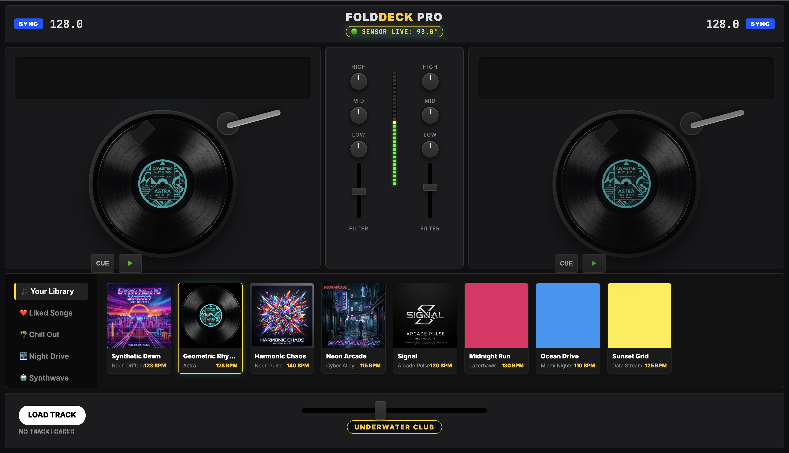
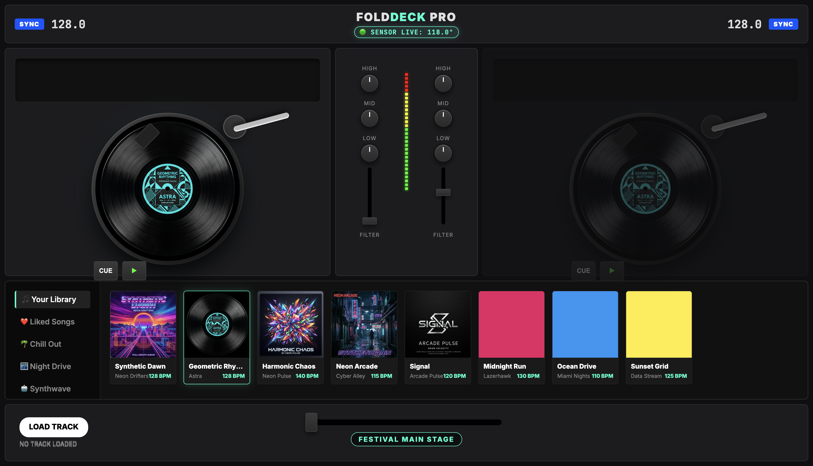
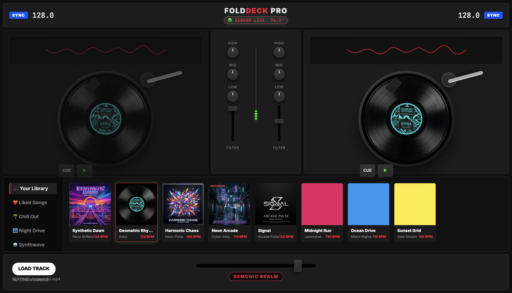
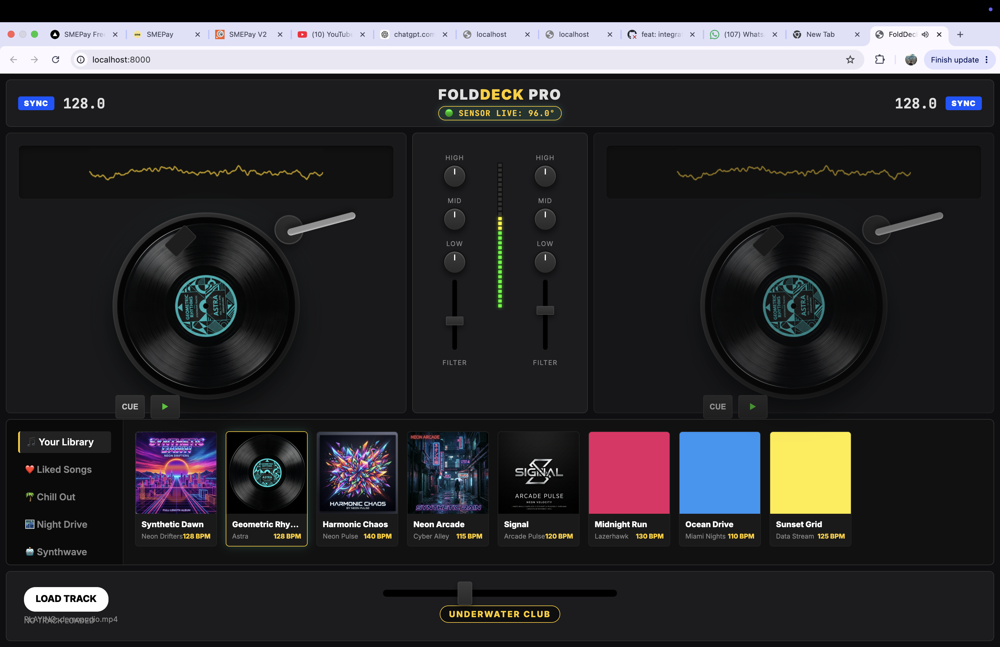

# 🎛️ FoldDeck Pro

FoldDeck Pro is an experimental, interactive DJ application that transforms your Mac laptop lid into a physical hardware controller. Built with Python, WebSockets, and Web Audio API, it maps the physical angle of your laptop screen to real-time audio manipulation.



## 🚀 How It Works

FoldDeck utilizes a hardware-software bridge:
1. **The Sensor (`pybooklid`)**: A Python backend constantly reads your MacBook's lid angle sensor.
2. **WebSocket Streaming**: The raw angle data is streamed with ultra-low latency to a local WebSocket server.
3. **Web Audio UI**: The frontend (HTML/CSS/JS) intercepts this data and dynamically applies Web Audio API filters to the currently playing track.

### 🎚️ Dynamic Modes

The application reacts visually and acoustically depending on the lid's position:
- **> 100° (FESTIVAL MAIN STAGE)**: Fully open. 100% volume, unaltered high-frequency playback, bright UI.
- **90°-100° (UNDERWATER CLUB)**: The sound starts to muffle with a slight pitch drop.
- **80°-90° (DEEP ABYSS)**: Heavy lowpass filter with significantly slower playback.
- **< 80° (DEMONIC REALM)**: Extreme lowpass, chaotic pitch drops, and dark UI.
- **⚡ SCRATCHING!**: Snapping the lid quickly calculates the angular velocity and triggers an instant "scratch" effect, complete with rapid pitch shifts and UI flashes.

## 🛠️ Running Locally

1. Ensure you are using macOS (requires `pybooklid` compatibility for the lid sensor).
2. Install the backend dependencies:
   ```bash
   pip install websockets pybooklid
   ```
3. Run the startup script (which launches both the HTTP server for the UI and the WebSocket backend):
   ```bash
   ./run.sh
   ```
4. Open your browser and navigate to `http://localhost:8000`.
5. Upload an audio track, press play, and start moving your lid!

## 📸 Screenshots




