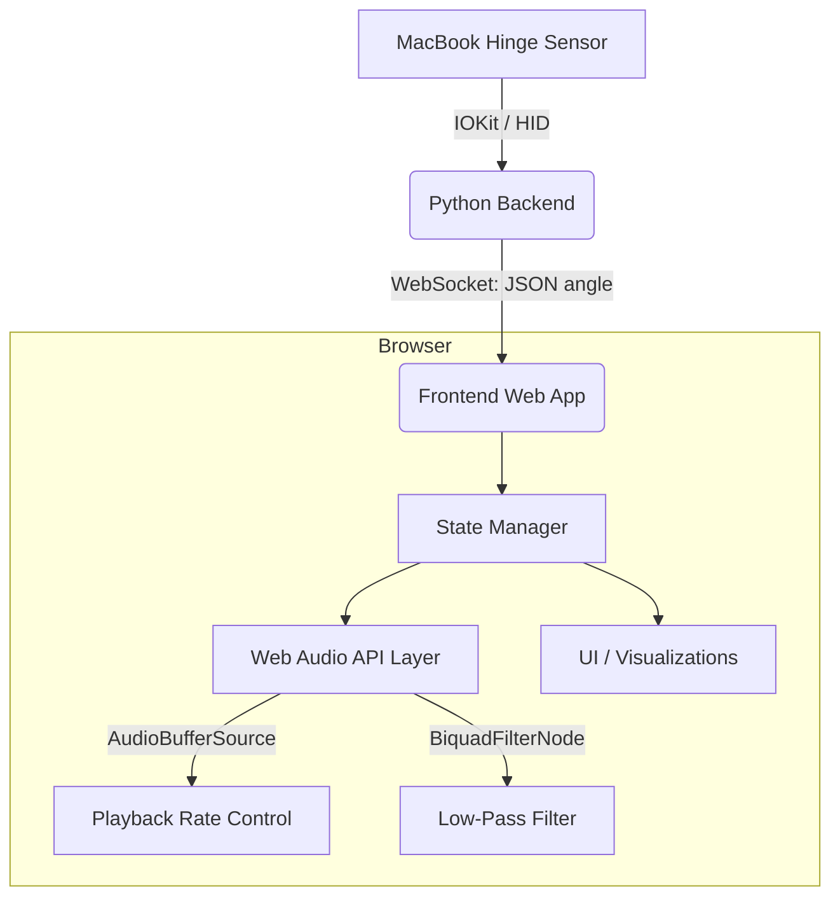

# Project Plan: MacMix (Working Title)

This document contains the feasibility analysis, technical architecture, and MVP definition for your Day 16 project: using a MacBook lid as a DJ controller.

## User Review Required
> [!IMPORTANT]
> **M3 Compatibility Risk**
> Before writing any frontend code, we must verify that your M3 MacBook can actually read the lid angle. `pybooklid` (used by iHarmonium) has known compatibility issues with M-series chips because Apple changed how the sensor is exposed (moving from SMC to HID). We might need to use a different C++ library (like `ufoym/mac-angle`) if `pybooklid` fails to initialize.

## Part 1: Feasibility Analysis

**How lid-angle data is obtained:**
Modern MacBooks contain a hall-effect or hinge angle sensor that detects the physical angle of the screen relative to the keyboard deck. Historically, this was read via the System Management Controller (SMC). On Apple Silicon, it is exposed as a Human Interface Device (HID).

**How `pybooklid` works:**
`pybooklid` wraps macOS IOKit C-level APIs into a Python module. In the `iHarmonium` repo, it polls the sensor in a loop with a small delay (`interval=0.05` seconds, or 20 Hz) and yields the angle in degrees.

**M3 MacBook Air (2024) Support:**
The M3 hardware definitely *has* the sensor, but `pybooklid` may fail to read it out of the box due to hardware identifier changes in Apple Silicon. If `pybooklid` throws an initialization error, we will need to pivot to an Apple Silicon-compatible C++ alternative (like `mac-angle`) and wrap it in a simple Python script.

**Real-time Speed for DJ Effects:**
A 20Hz polling rate (50ms latency) is fast enough for continuous effects like **Filter Sweeps**, **Volume fading**, or **Playback speed** adjustments. However, it is **not fast enough for precise scratching**. Physical scratching requires near-zero latency and high-frequency polling to calculate velocity and direction accurately.

---

## Part 2: Technical Architecture

1.  **Hardware Input:** MacBook Lid Angle Sensor.
2.  **Python Backend:** A lightweight `asyncio` + `websockets` server that reads the sensor and broadcasts the angle (e.g., `{"angle": 85.5}`).
3.  **Frontend Interface:** A vanilla HTML/JS/CSS application that connects to the WebSocket.
4.  **Audio Processing:** The native Web Audio API (`AudioContext`). The incoming angle updates specific properties (like `.frequency.value` on a filter).

---

## Part 3: MVP Definition

To build this in a few hours and get a viral demo video, we must ruthlessly prioritize.

**Features to Include:**
*   **Single hardcoded/uploaded track:** A high-energy electronic track that sounds good when slowed down or filtered.
*   **Dual Effect Mapping:** 
    *   *Angle 120° - 90°:* Pitch/Speed bends down slightly.
    *   *Angle 89° - 30°:* Heavy Low-Pass filter kicks in (the "muffled club" sound).
*   **Big bold UI:** A large circular dial that rotates perfectly in sync with the physical lid angle.

**Features to Cut (Do NOT build today):**
*   Scratching (Too hard to get the physics and latency right in a few hours).
*   Multiple tracks / Crossfading / Deck A vs Deck B.
*   Complex beat-matching.

---

## Part 4: Audio Effects Analysis

Here is the ranking of Web Audio API effects from easiest to hardest:

1.  **Playback Speed (Easiest):** Directly modify `source.playbackRate.value`. Native, zero overhead.
2.  **Filter Sweeps (Easiest):** `BiquadFilterNode`. Change `frequency.value`. Sounds incredibly professional with minimal code.
3.  **Bass Boost (Easy):** `BiquadFilterNode` set to `lowshelf`.
4.  **Echo / Delay (Moderate):** Requires routing a `DelayNode` back into itself via a `GainNode`.
5.  **Reverb (Moderate):** Requires a `ConvolverNode` and an impulse response audio file.
6.  **Pitch Shifting (Hard):** The native API ties pitch and speed together. Changing pitch *without* changing speed requires heavy custom algorithms or loading a library like Tone.js.
7.  **Scratching (Hardest):** Requires simulating vinyl momentum, reverse playback buffering, and sub-millisecond sensor latency.

> [!TIP]
> **MVP Recommendation:** Use a combination of **Playback Speed** and a **Low-Pass Filter Sweep**. When you close the lid, the track slows down slightly and gets heavily muffled, creating a massive drop effect when you rip the laptop open again.

---

## Part 5: User Experience & UI

**Product Names:**
*   **LidJ** (Lid + DJ)
*   **FoldDeck**
*   **AngleMix**

**Visual Design:**
*   **Dark Mode:** Deep blacks, neon accents (cyan/magenta).
*   **The Hero Element:** A massive, smooth 3D-looking dial or arc in the center of the screen that visually represents the lid. As you close the laptop, the arc physically rotates down on screen.
*   **Metrics:** Huge, bold typography displaying the exact angle: `94.2°` constantly updating. This proves to the viewer that it's real-time.
*   **Audio Visualizer:** A simple frequency bar spectrum at the bottom that reacts to the music. When the lid closes and the high frequencies are filtered out, the visualizer will naturally flatten out, creating a great visual cue.

---

## Part 6: LinkedIn Potential

This is a **10/10** for a daily builder project.

**Why it's better than cloning iHarmonium:**
iHarmonium is a fun novelty, but it maps a hardware input to a 1:1 expected output (bellows pumping). It's very literal.
*MacMix* takes a mundane sensor designed for sleep/wake functionality and turns the entire physical chassis of a $1000+ computer into a tactile DJ controller. 

**Demo Video Idea (15 seconds):**
1.  Camera points at you playing a track on the laptop.
2.  Text overlay: *"I didn't have a DJ controller, so I turned my MacBook lid into one."*
3.  You grab the top of the screen and pull it down. The music instantly muffles and slows down (like walking out of a club). The on-screen UI angle updates in real-time.
4.  You whip the lid open exactly as the beat drops.

This hits the "Wait, what?" factor perfectly. It requires hardware interaction, looks great on camera, and leverages hidden data streams creatively.
