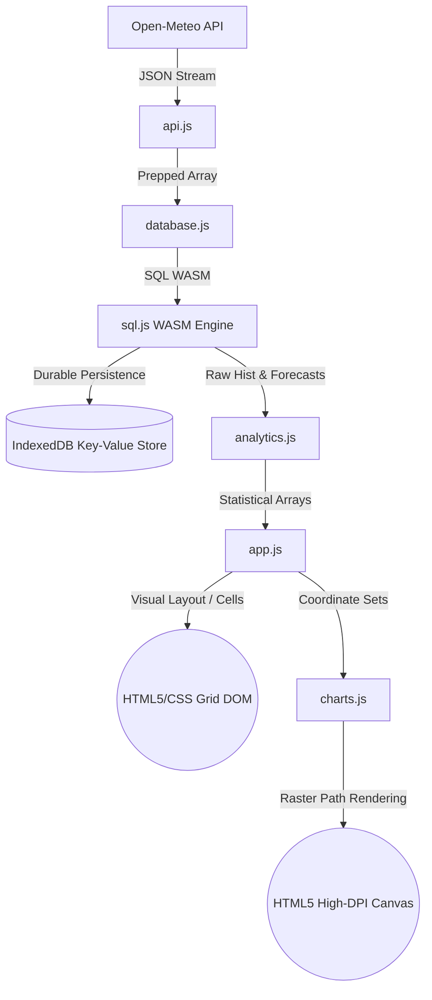

# AeroIntel — Technical Architecture Document

This document outlines the system architecture, data flow pipelines, and mathematical models that run AeroIntel entirely in the user's browser.

---

## 1. High-Level Architecture

AeroIntel follows a client-side **Ingest ➔ Store ➔ Analyze ➔ Present** time-series data pipeline, mimicking production-grade data engineering patterns:



---

## 2. Component Pipeline Specifications

### Phase A: Data Ingest (`api.js`)
*   **Source**: Fetches meteorological timelines from the Open-Meteo Geocoding and Air Quality APIs.
*   **Format**: Asynchronously processes arrays of hourly timestamps mapped to PM2.5, PM10, Ozone ($O_3$), Nitrogen Dioxide ($NO_2$), Sulphur Dioxide ($SO_2$), Carbon Monoxide ($CO$), Dust, and UV Index.
*   **Error Resilience**: Utilizes `Promise.allSettled` to fetch data for multiple cities in parallel. This ensures a failure in one city's API call doesn't halt data ingestion for the others.

### Phase B: SQL Storage & Durable Persistence (`database.js`)
*   **In-Memory Database Engine**: Uses `sql.js` (SQLite compiled to WebAssembly) to run a relational SQL database in-memory. This allows for fast SQL query executions inside the browser.
*   **Idempotency (Deduplication)**: Uses `INSERT OR IGNORE` combined with a `UNIQUE(city, reading_time)` schema constraint. This ensures duplicate writes are skipped.
*   **IndexedDB Durability**: Because the WebAssembly SQL engine is volatile (lost on tab refresh), we serialize the database to a binary array on every insert:
    ```javascript
    const binaryArray = this.db.export();
    ```
    This binary array is written to IndexedDB as a single large binary blob. On boot, the app fetches the blob from IndexedDB and re-instantiates the SQLite engine, achieving persistence across browser restarts.

### Phase C: Analytics & Mathematics (`analytics.js`)
Calculates the statistical models in JavaScript since standard SQLite WASM lacks advanced math packages (like standard deviation or square roots):
*   **Simple Moving Average (SMA)**:
    $$SMA_k = \frac{1}{N} \sum_{i=0}^{N-1} x_{k-i}$$
*   **Rolling Volatility (Standard Deviation)**: Applies Bessel's correction ($N-1$) for unbiased sample variance:
    $$\sigma = \sqrt{\frac{1}{N-1} \sum_{i=1}^N (x_i - \bar{x})^2}$$
*   **Linear Regression Forecasting**: Fits a least-squares line ($y = mx + c$) over the 24-hour historical window:
    $$m = \frac{N \sum (xy) - \sum x \sum y}{N \sum (x^2) - (\sum x)^2}, \quad c = \frac{\sum y - m \sum x}{N}$$
    Projects the line forward to forecast the next 6 hours ($x_{new} = t + 1 \dots t + 6$).
*   **Pearson Correlation**: Compares two pollutant timelines to calculate covariance:
    $$r = \frac{\sum (x_i - \bar{x})(y_i - \bar{y})}{\sqrt{\sum (x_i - \bar{x})^2 \sum (y_i - \bar{y})^2}}$$

### Phase D: Presentation & Visualization (`charts.js` + `app.js`)
*   **Canvas Grid Coordinate Mapping**: Normalizes numerical readings into canvas pixel coordinates. For any value $v$ within data range $[v_{min}, v_{max}]$ and canvas height $H$ with paddings $P_{top}$ and $P_{bottom}$:
    $$y_{pixel} = P_{top} + (H - P_{top} - P_{bottom}) \times \left(1 - \frac{v - v_{min}}{v_{max} - v_{min}}\right)$$
*   **Color Resolution & Safety**: Uses the custom `_getTranslucentColor()` helper to safely parse CSS Hex, RGB, or OKLCH properties and map them to translucent formats (e.g. `rgba(r,g,b,alpha)`), preventing syntax errors in standard Canvas rendering contexts.
*   **Heatmap Rendering**: Employs CSS Grid to render a 6x6 correlation cell matrix. Colors cells using dynamic OKLCH transparency functions:
    ```css
    background: oklch(0.62 0.20 28 / [r-value])
    ```
    Binds cell clicks to update the analyst panel with detailed chemical interaction explanations.
