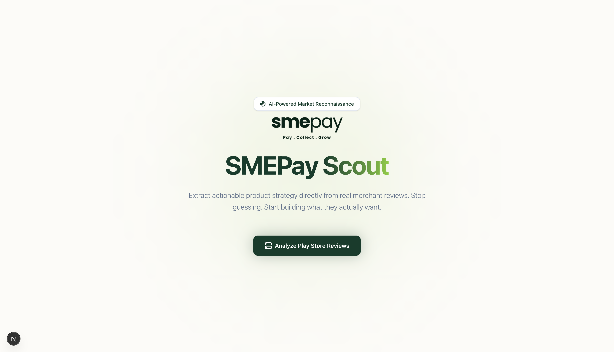
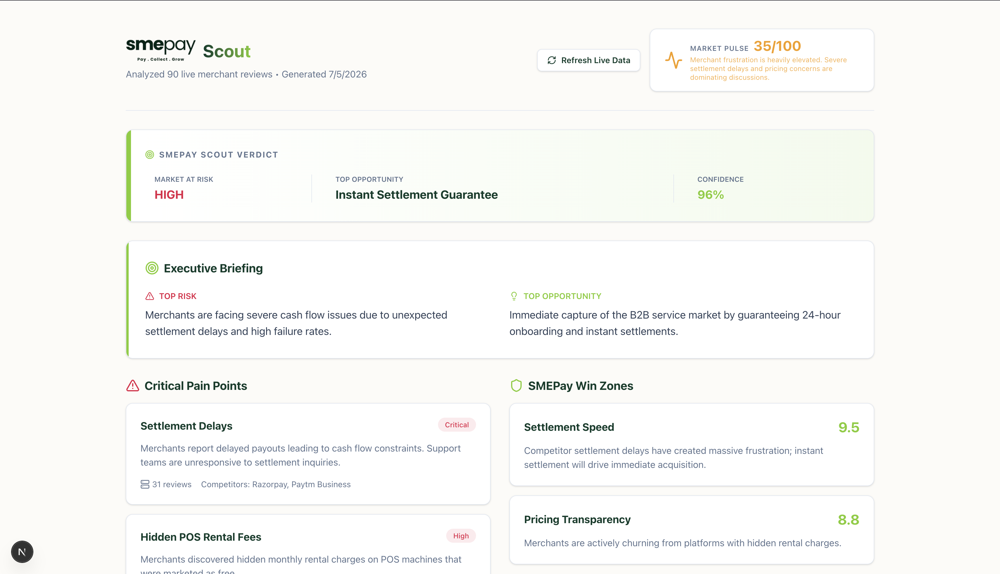
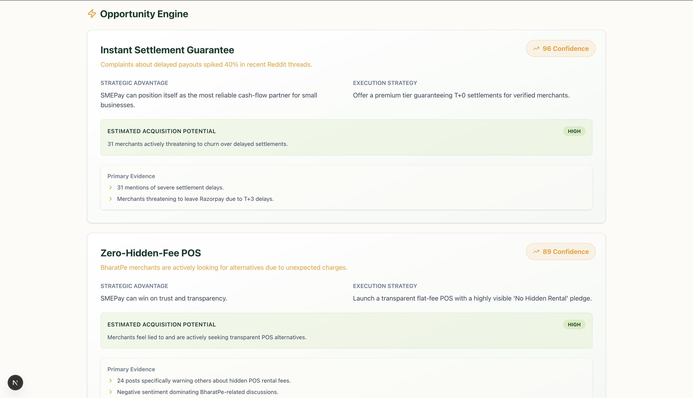
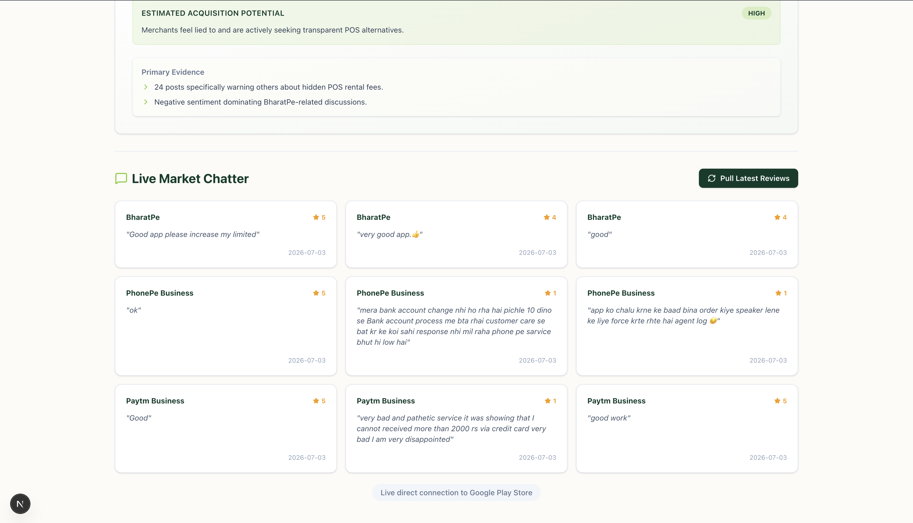

# SMEPay Scout (Intelligence Hub)

**SMEPay Scout** is an AI-powered Market Intelligence Dashboard designed as an internal strategic tool for executives and product managers. It actively monitors the market and dictates exactly what features to build next to steal market share.

## 📸 Dashboard Preview

<div align="center">
  
  
  
  
</div>

## 🚀 Key Features

1. **Live Data Ingestion Pipeline:** A custom web scraper that pulls real-time grievances and reviews from competitor merchant apps (BharatPe, PhonePe Business, Paytm Business) on the Google Play Store, bypassing traditional API limitations.
2. **AI Intelligence Engine:** Integrates Google Gemini 1.5 Pro to synthesize raw unstructured reviews into an actionable JSON strategy payload.
3. **Executive Dashboard:** A Next.js frontend built with TailwindCSS that strictly adheres to SMEPay's brand identity. It features a Market Pulse score, Critical Pain Points, Win Zones, and an Opportunity Engine.
4. **Live Market Chatter:** A dedicated module that streams the raw, live reviews straight from the Play Store to guarantee authenticity.

## 🛠️ Tech Stack
- **Frontend:** Next.js (React), Tailwind CSS, Lucide React
- **Backend:** Python, FastAPI, Uvicorn
- **Data Ingestion:** `google-play-scraper`
- **AI Intelligence:** Google Gemini 1.5 Pro

## 📦 How to Run Locally

### 1. Start the FastAPI Backend
```bash
cd backend
python3 -m venv venv
source venv/bin/activate
pip install -r requirements.txt

# Create a .env file with your GEMINI_API_KEY
uvicorn main:app --reload
```

### 2. Start the Next.js Frontend
```bash
cd frontend
npm install
npm run dev
```

Open [http://localhost:3000](http://localhost:3000) in your browser.
