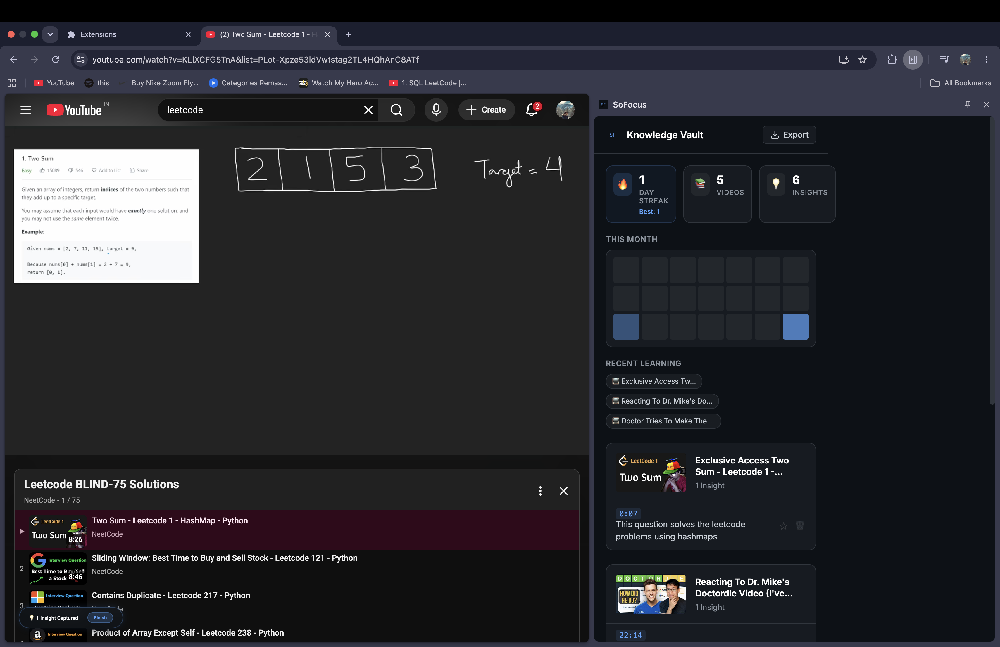
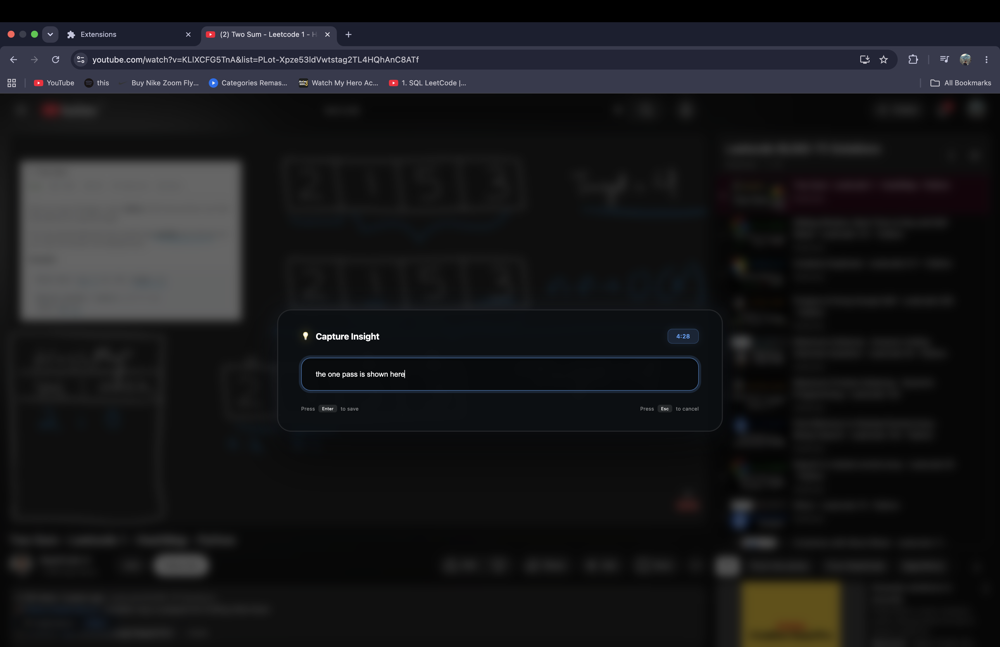
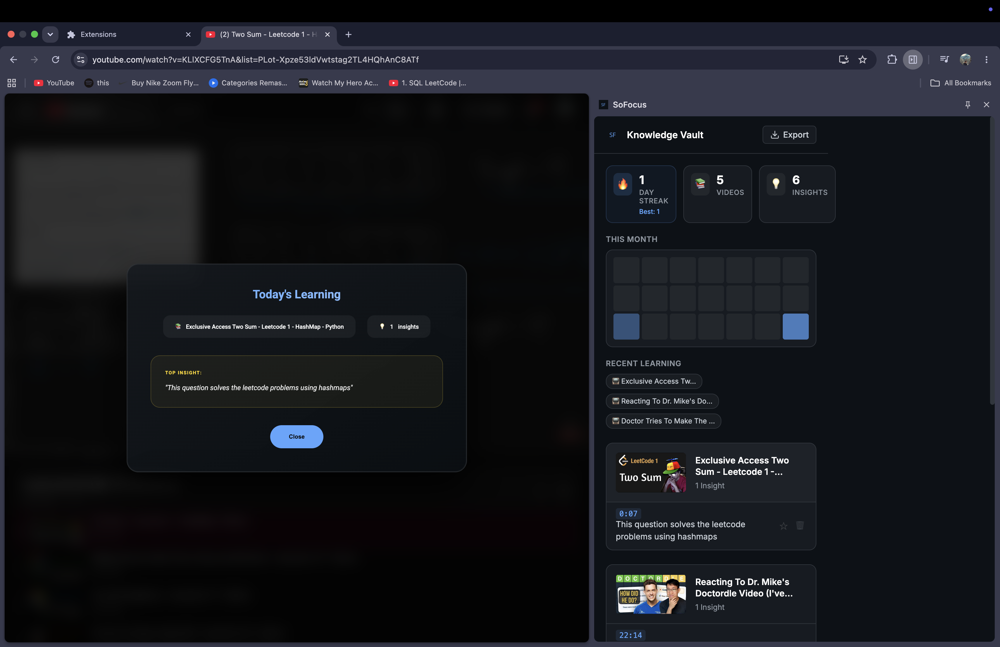

# SoFocus: The Learning Memory System

**Day 13 of my 30-Day Builder Challenge**

SoFocus is a Chrome Extension that transforms passive YouTube watching into an active learning system. Instead of getting distracted or passively consuming tutorials without retaining the information, SoFocus allows you to instantly lock in insights, build a learning streak, and export your knowledge.

## ✨ Features

- **⚡ Instant Capture (Shadow DOM):** Press `Cmd+Shift+S` (or `Ctrl+Shift+S`) to instantly pause the video and open a distraction-free input overlay injected directly into the YouTube player.
- **📈 Learning Dashboard:** A comprehensive vault that visualizes your consistency with a 21-day GitHub-style heatmap, tracks your learning streaks, and organizes your recent topics.
- **⭐ Key Insights:** Star your favorite "Aha!" moments to feature them at the top of your dashboard.
- **🎉 Session Summaries:** When you finish a learning session, review an elegant summary of your top insights before closing the tab.
- **📋 Export to Second Brain:** Instantly export your entire knowledge vault into a beautifully formatted Markdown digest, complete with clickable timestamp links back to the exact moment in the video.

## 📸 Screenshots

* **The Dashboard:** Show off the heatmap, streaks, and "Key Insight" banner.*

* **The YouTube Overlay:** Show the glassmorphism UI over a paused tutorial.*

* **The Session Badge / Summary:** Show the session summary modal.*

## 🛠 Tech Stack

- **Frontend:** Vanilla JavaScript, HTML, CSS (No frameworks)
- **Architecture:** Chrome Extension (Manifest V3)
- **APIs:** Chrome Extensions API (`storage`, `contextMenus`, `commands`, `sidePanel`)
- **Key Concepts:** Content Scripts, Service Workers, Shadow DOM Isolation, Message Passing

## 🚀 How to Install Locally

Since this extension isn't published to the Chrome Web Store, you can run it locally in developer mode:

1. Clone this repository.
2. Open Chrome and navigate to `chrome://extensions/`.
3. Enable **Developer mode** using the toggle in the top right corner.
4. Click **Load unpacked** and select the `sofocus` directory.
5. Go to any YouTube video and press `Cmd+Shift+S` to capture your first insight!

## 🧠 The "Why" Behind The Product

Most people treat note-taking on YouTube as an afterthought. You watch a 40-minute tutorial, maybe jot down one thing in Notion, and never look at it again. SoFocus solves the psychological barrier of learning by bringing the note-taking directly to the player, making it frictionless, and gamifying the process of capturing knowledge with streaks and heatmaps.
